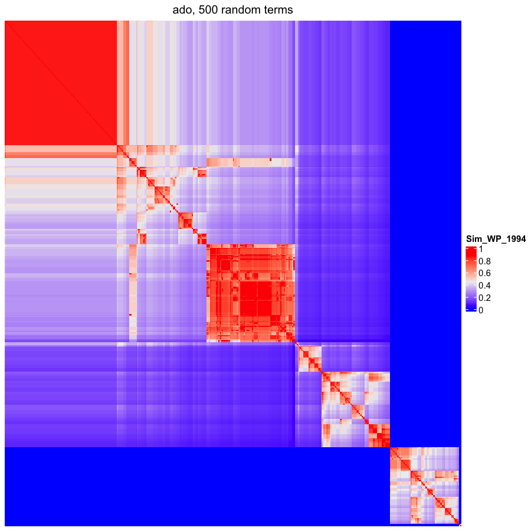
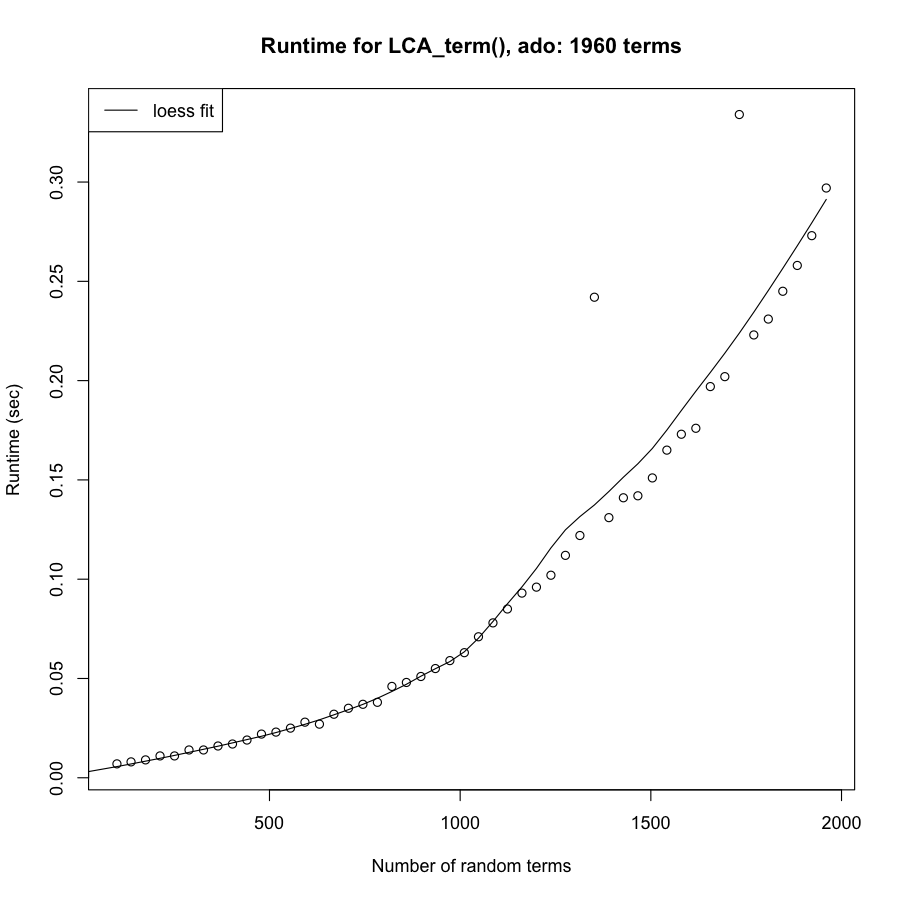

```{r, echo = FALSE, message = FALSE}
library(knitr)
knitr::opts_chunk$set(
    error = FALSE,
    tidy  = FALSE,
    message = FALSE,
    warning = FALSE,
    fig.width = 6, fig.height = 6,
    fig.align = "center")
```

<style>
.main-container {
    max-width: 1200px;
}
.show_image {
    font-size: 0.8em;
}
#image {
    margin-top: 10px;
    margin-bottom: 10px;
}
.show_image {
    text-decoration: underline;
    color: #337ab7;
}
.show_image:hover {
    cursor: pointer;
}
</style>

[OBO Foundry](http://obofoundry.org/) is a database of public biological
ontologies. In this document, we import all the ontologies on OBO Foundry and
generate circular visualizations on them.

Columns in the table:

- `id`: ID of the ontology.
- `title`: Title of the ontology.
- `n_terms`: Number of terms.
- `n_relations`: Number of relations.
- `is_tree`: Whether the DAG is a tree. The DAG is a tree if n_terms == n_relations + 1.
- `pa_avg`: Average number of parent terms.
- `ch_avg`: Average number of child terms.
- `asp1`: `width/height`, where `width` is the largest number of terms on a specific distance to root (i.e. `max(table(largest_dist_to_root(dag)))`).
- `asp2`: `width/height`, where `width` is the largest number of terms on a specific distance to root (i.e. `max(table(shortest_dist_to_root(dag)))`).
- `d_q99`: 99% quantile of depth of terms.

Script for formatting the table and generating the plots is [OBOFoundry.R](OBOFoundry.R).

<hr>

```{r, echo = FALSE}
library(DT)
library(GetoptLong)
df = readRDS("OBOFoundry_summary.rds")
df = df[df$n_terms > 0, ]
id = df$id
df$id = qq("<a href='http://obofoundry.org/ontology/@{df$id}.html' target=_blank>@{df$id}</a>", collapse = FALSE)
df$title = qq("@{df$title} <span class='show_image' onclick='show_image(\"@{id}\")'>[image]</span>", collapse = FALSE)
df$avg_parents = round(df$avg_parents, 1)
df$avg_children = round(df$avg_children, 1)
df$is_tree = ifelse(df$n_terms == df$n_relations + 1, "tree", "")
df = df[, c("id", "title", "n_terms", "n_relations", "is_tree", "avg_parents", "avg_children", "asp1", "asp2", "depth_q99")]
datatable(df, escape = FALSE, rownames = FALSE,
    colnames = c("id", "title", "n_terms", "n_relations", "is_tree", "pa_avg", "ch_avg", "asp1", "asp2", 'd_q99'))
```

<hr>

<style>
#image ul li {
    font-size: 16px;
    padding-right:10px;
    cursor: pointer;
    display: inline-block;
    color: #337ab7;
}
#image ul {
    padding-inline-start: 0px;
    margin-top: 20px;
}
</style>

<div id="image">
<h3>Plots for ontology: ado</h3>
<ul>
<li><a id="circular_click">Circular visualization</a></li>
<li><a id="heatmap_click" style="color:grey">Similarity heatmap</a></li>
<li><a id="runtime_click" style="color:grey">Runtime</a></li>
</ul>
<div id="circular">
</div>
<div id="heatmap" style="display:none;"></div>
<div id="runtime" style="display:none;"></div>
</div>


<script>
function show_image(id) {
    $("#image1").attr("src", "image/OBOFoundry_" + id + ".png");
    $("#image2").attr("src", "image/OBOFoundry_" + id + "_heatmap.png");
    $("#image3").attr("src", "image/OBOFoundry_" + id + "_runtime.png");
    $("#image h3").text("Plots for ontology: " + id);
    document.getElementById("image").scrollIntoView();
}

$( function() {
    $( "#circular_click" ).click(function() {
        $("#circular").show();
        $("#heatmap").hide();
        $("#runtime").hide();
        $("#circular_click").css("color", "#337ab7");
        $("#heatmap_click").css("color", "grey");
        $("#runtime_click").css("color", "grey");
    });
    $( "#heatmap_click" ).click(function() {
        $("#heatmap").show();
        $("#circular").hide();
        $("#runtime").hide();
        $("#circular_click").css("color", "grey");
        $("#heatmap_click").css("color", "#337ab7");
        $("#runtime_click").css("color", "grey");
    })
    $( "#runtime_click" ).click(function() {
        $("#runtime").show();
        $("#heatmap").hide();
        $("#circular").hide();
        $("#runtime_click").css("color", "#337ab7");
        $("#heatmap_click").css("color", "grey");
        $("#circular_click").css("color", "grey");
    });
} );
</script>
