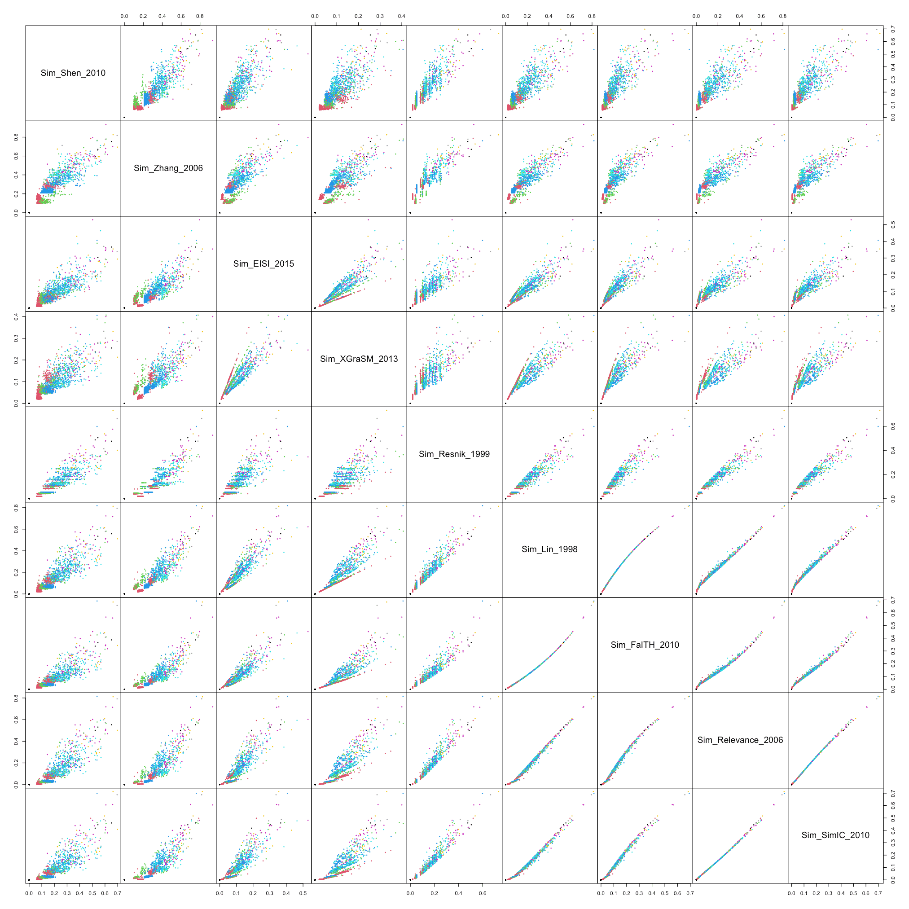
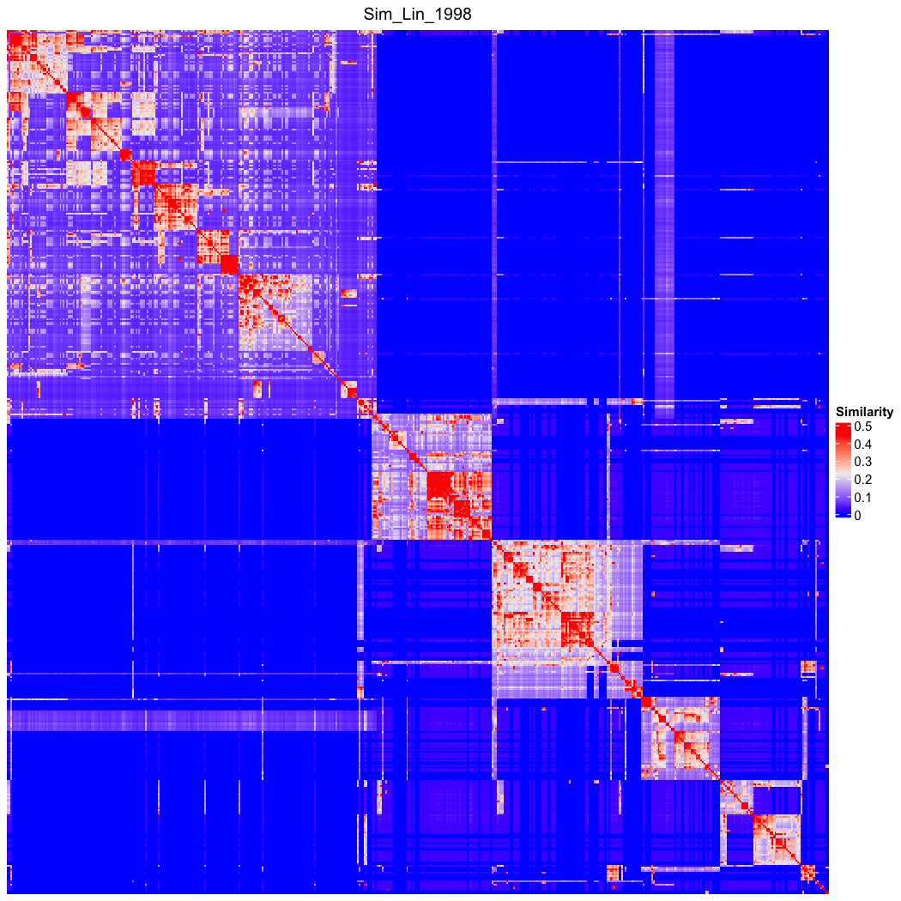

```{r, echo = FALSE, message = FALSE}
library(knitr)
knitr::opts_chunk$set(
    error = FALSE,
    tidy  = FALSE,
    message = FALSE,
    warning = FALSE,
    fig.width = 6, fig.height = 6,
    fig.align = "center")

knitr::knit_hooks$set(pngquant = knitr::hook_pngquant)

knitr::opts_chunk$set(
  message = FALSE,
  dev = "ragg_png",
  fig.align = "center",
  pngquant = "--speed=10 --quality=30"
)
```

**simona** supports many methods for calculating semantic similarities (term sim). In
this document, we compare different term sim methods using Gene Ontology as the test
ontology.

By default, we use the Biological Process (BP) namespace in GO. We only take
`"is_a"` and `"part_of"` as the relation types. The `org_db` argument is also
set to human for the annotation-based method.


```{r}
library(simona)
dag = create_ontology_DAG_from_GO_db(org_db = "org.Hs.eg.db")
dag
```


All term sim methods supported in **simona** are listed as follows. The full
description of these IC methods can be found in the vignettes of **simona**.

```{r}
all_term_sim_methods()
```

We compare all supported term sim methods, using 500 random GO terms as test.
Since we also compare annotation-based methods, we randomly sample 500 GO terms
from those terms having gene annotations.

```{r}
set.seed(123)
ic = term_IC(dag, method = "IC_annotation")
ic = ic[!is.na(ic)]
go_id = sample(names(ic), 500)
```

We calculate similarities with different term sim methods and save the results in a list.

```{r}
lt = lapply(all_term_sim_methods(), function(method) {
    term_sim(dag, go_id, method)
})
names(lt) = all_term_sim_methods()
```

For comparison, we take the lower triangle matrix and merge all similarities values from
different methods into a data frame.

```{r}
df = as.data.frame(lapply(lt, function(x) x[lower.tri(x)]))
```

We calculate the correlations between similarity vectors from different methods and
make the correlation heatmap. As 1 - correlation is also a dissimilarity
measurement, we directly generate the hierarchical clustering based on `1 -
cor`.


```{r, fig.width = 9, fig.height = 8}
cor = cor(df, use = "pairwise.complete.obs")
hc = hclust(as.dist(1 - cor))
library(ComplexHeatmap)
Heatmap(cor, name = "correlation", cluster_rows = hc, cluster_columns = hc,
    row_dend_reorder = TRUE, column_dend_reorder = TRUE,
    column_title = "Semantic similarity correlation, GO BP")
```


We next remove the following term sim methods which show very different patterns
to other term sim methods, and remake the heatmap.

```{r, fig.width = 8, fig.height = 8}
ind = which(colnames(df) %in% c("Sim_Jiang_1997", "Sim_HRSS_2013", "Sim_universal",
    "Sim_Dice", "Sim_Kappa", "Sim_Jaccard", "Sim_Overlap"))
cor2 = cor[-ind, -ind]
df2 = df[, -ind]

hc = hclust(as.dist(1 - cor2))
Heatmap(cor2, name = "correlation", cluster_rows = hc, cluster_columns = hc,
    row_dend_reorder = TRUE, column_dend_reorder = TRUE,
    column_title = "Semantic similarity correlation, GO BP")
```

We can observe that all the term sim methods can be put into five groups. We manually add
group labels to these term sim methods:

```{r}
group = c("Sim_Shen_2010" = 1,
          "Sim_Zhang_2006" = 1,
          "Sim_EISI_2015" = 1,
          "Sim_XGraSM_2013" = 1,
          "Sim_Resnik_1999" = 1,
          "Sim_Lin_1998" = 1,
          "Sim_FaITH_2010" = 1,
          "Sim_Relevance_2006" = 1,
          "Sim_SimIC_2010" = 1,
          "Sim_SSDD_2013" = 2,
          "Sim_RSS_2013" = 2,
          "Sim_Zhong_2002" = 2,
          "Sim_Slimani_2006" = 2,
          "Sim_Pekar_2002" = 3,
          "Sim_WP_1994" = 3,
          "Sim_Shenoy_2012" = 3,
          "Sim_Stojanovic_2001" = 3,
          "Sim_Li_2003" = 3,
          "Sim_Wang_edge_2012" = 3,
          "Sim_Wang_2007" = 4,
          "Sim_Ancestor" = 4,
          "Sim_AIC_2014" = 4,
          "Sim_GOGO_2018" = 4,
          "Sim_AlMubaid_2006" = 5,
          "Sim_Leocock_1998" = 5,
          "Sim_Rada_1989" = 5,
          "Sim_Resnik_edge_2005" = 5)
```

Next we perform MDS (multidimension scaling) analysis on the `1-cor` distance matrix and
visualize the first two dimensions. 


```{r, fig.width = 7, fig.height = 6}
library(ggrepel)
library(ggplot2)
loc = cmdscale(as.dist(1-cor2))
loc = as.data.frame(loc)
colnames(loc) = c("x", "y")
loc$method = rownames(loc)

loc$group = group[rownames(loc)]

ggplot(loc, aes(x, y, label = method, col = factor(group))) + 
    geom_point() + 
    geom_text_repel(show.legend = FALSE, size = 3) +
    labs(x = "Dimension 1", y = "Dimension 2", col = "Group") +
    ggtitle("MDS based on the correlation between similarities from different term sim methods")
```


```{r, echo = FALSE, eval = FALSE}
od = hclust(dist(lt[["Sim_Lin_1998"]]))$order
for(nm in names(lt)) {
    png(paste0("image/go_bp_random_500_sim_", nm, ".png"), width = 700*1.5, height = 700*1.5, res = 72*1.5)
    draw(Heatmap(lt[[nm]], name = "Similarity", column_title = nm,
        show_row_names = FALSE, show_column_names = FALSE,
        show_row_dend = FALSE, show_column_dend = FALSE))
    dev.off()

    png(paste0("image/go_bp_random_500_sim_", nm, "_Lin_order.png"), width = 700*1.5, height = 700*1.5, res = 72*1.5)
    draw(Heatmap(lt[[nm]], name = "Similarity", column_title = nm,
        row_order = od, column_order = od,
        show_row_names = FALSE, show_column_names = FALSE))
    dev.off()
}
```


The pairwise scatter plot of semantic similarities from two term sim methods.

```{r, eval = FALSE, echo = FALSE}
LCA_depth = LCA_depth(dag, go_id)
LCA_depth = LCA_depth[lower.tri(LCA_depth)]

library(GetoptLong)
for(i in 1:5) {
    l = group == i
    g = names(group)[l]
    ind = sample(nrow(df2), 5000)

    png(qq("image/scatterplot_group_@{i}_foo.png"), 
        width = 150*sum(l)*1.5, height = 150*sum(l)*1.5, res = 72*1.5)
    pairs(df2[ind, g], pch = 16, cex = 0.5, gap = 0, col = LCA_depth[ind]+1)
    dev.off()

    system(qq("pngquant --speed=10 --quality=60 image/scatterplot_group_@{i}_foo.png -o image/scatterplot_group_@{i}.png --force"))
    file.remove(qq("image/scatterplot_group_@{i}_foo.png"))

}
```


<style>
#scatterplot ul li {
    padding-right:20px;
    cursor: pointer;
    display: inline-block;
    color: #337ab7;
}
#scatterplot ul {
    padding-inline-start: 0px;
    margin-top: 20px;
}
</style>

<div id="scatterplot">
<ul>
<li><a id="scatterplot_group1" style="color:#337ab7" onclick="switch_scatterplot(1);">Group 1</a></li>
<li><a id="scatterplot_group2" style="color:grey" onclick="switch_scatterplot(2);">Group 2</a></li>
<li><a id="scatterplot_group3" style="color:grey" onclick="switch_scatterplot(3);">Group 3</a></li>
<li><a id="scatterplot_group4" style="color:grey" onclick="switch_scatterplot(4);">Group 4</a></li>
<li><a id="scatterplot_group5" style="color:grey" onclick="switch_scatterplot(5);">Group 5</a></li>
</ul>
<div>
</div>
</div>

<script>
scatterplot_size = [9, 4, 6, 4, 4];
$("#scatterplot_image").width(scatterplot_size[0]*150);
function switch_scatterplot(i) {
    $("#scatterplot_image").attr("src", "image/scatterplot_group_" + i + ".png");
    $("#scatterplot_image").width(scatterplot_size[i-1]*150);
    $("#scatterplot_group1").css("color", "grey");
    $("#scatterplot_group2").css("color", "grey");
    $("#scatterplot_group3").css("color", "grey");
    $("#scatterplot_group4").css("color", "grey");
    $("#scatterplot_group5").css("color", "grey");
    $("#scatterplot_group" + i).css("color", "#337ab7");
}
</script>

<hr>

<style>
#prev, #next {
    text-decoration: underline;
    color: #337ab7;
}
#prev:hover, #next:hover {
    cursor: pointer;
}
#prev, #curr {
    margin-right: 50px;
}
#image p {
    text-align: center;
}
</style>

Finally, you can select an individual similarity heatmap by: <select id="select">
  <option value='0'>Sim_Lin_1998</option>
  <option value='1'>Sim_Resnik_1999</option>
  <option value='2'>Sim_FaITH_2010</option>
  <option value='3'>Sim_Relevance_2006</option>
  <option value='4'>Sim_SimIC_2010</option>
  <option value='5'>Sim_XGraSM_2013</option>
  <option value='6'>Sim_EISI_2015</option>
  <option value='7'>Sim_AIC_2014</option>
  <option value='8'>Sim_Zhang_2006</option>
  <option value='9'>Sim_universal</option>
  <option value='10'>Sim_Wang_2007</option>
  <option value='11'>Sim_GOGO_2018</option>
  <option value='12'>Sim_Rada_1989</option>
  <option value='13'>Sim_Resnik_edge_2005</option>
  <option value='14'>Sim_Leocock_1998</option>
  <option value='15'>Sim_WP_1994</option>
  <option value='16'>Sim_Slimani_2006</option>
  <option value='17'>Sim_Shenoy_2012</option>
  <option value='18'>Sim_Pekar_2002</option>
  <option value='19'>Sim_Stojanovic_2001</option>
  <option value='20'>Sim_Wang_edge_2012</option>
  <option value='21'>Sim_Zhong_2002</option>
  <option value='22'>Sim_AlMubaid_2006</option>
  <option value='23'>Sim_Li_2003</option>
  <option value='24'>Sim_RSS_2013</option>
  <option value='25'>Sim_HRSS_2013</option>
  <option value='26'>Sim_Shen_2010</option>
  <option value='27'>Sim_SSDD_2013</option>
  <option value='28'>Sim_Jiang_1997</option>
  <option value='29'>Sim_Kappa</option>
  <option value='30'>Sim_Jaccard</option>
  <option value='31'>Sim_Dice</option>
  <option value='32'>Sim_Overlap</option>
  <option value='33'>Sim_Ancestor</option>
</select> <input id="use_lin_order" type="checkbox" /> Use order from Sim_Lin_1998

<span id="prev" value="33">Prev method: Sim_Ancestor</span> <span id="curr">Curr method: Sim_Lin_1998</span> <span id="next" value="1">Next method: Sim_Resnik_1999</span> 

<div id="image"><p></p></div>


```{r}
sessionInfo()
```

<script>
methods = ["Sim_Lin_1998", "Sim_Resnik_1999", "Sim_FaITH_2010", "Sim_Relevance_2006", "Sim_SimIC_2010", "Sim_XGraSM_2013", "Sim_EISI_2015", "Sim_AIC_2014", "Sim_Zhang_2006", "Sim_universal", "Sim_Wang_2007", "Sim_GOGO_2018", "Sim_Rada_1989", "Sim_Resnik_edge_2005", "Sim_Leocock_1998", "Sim_WP_1994", "Sim_Slimani_2006", "Sim_Shenoy_2012", "Sim_Pekar_2002", "Sim_Stojanovic_2001", "Sim_Wang_edge_2012", "Sim_Zhong_2002", "Sim_AlMubaid_2006", "Sim_Li_2003", "Sim_RSS_2013", "Sim_HRSS_2013", "Sim_Shen_2010", "Sim_SSDD_2013", "Sim_Jiang_1997", "Sim_Kappa", "Sim_Jaccard", "Sim_Dice", "Sim_Overlap", "Sim_Ancestor"];
$("#select").on("change", function() {
    i = parseInt($(this).val());
    suffix = ".png"
    if($("#use_lin_order").is(':checked')) {
        suffix = "_Lin_order.png"
    }
    $("#image img").attr("src", "image/go_bp_random_500_sim_" + methods[i] + suffix);
    $("#curr").text("Curr method: " + methods[i]);

    prev_i = i - 1;
    if(prev_i < 0) {
        prev_i = 33
    }
    $("#prev").attr("value", prev_i);
    $("#prev").text("Prev method: " + methods[prev_i]);

    next_i = i + 1;
    if(next_i > 33) {
        next_i = 0;
    }
    $("#next").attr("value", next_i);
    $("#next").text("Next method: " + methods[next_i]);
});
$("#prev").click(function() {
    i = parseInt($(this).attr("value"));
    suffix = ".png"
    if($("#use_lin_order").is(':checked')) {
        suffix = "_Lin_order.png"
    }
    $("#image img").attr("src", "image/go_bp_random_500_sim_" + methods[i] + suffix);
    $("#curr").text("Curr method: " + methods[i]);

    prev_i = i - 1;
    if(prev_i < 0) {
        prev_i = 33
    }
    $("#prev").attr("value", prev_i);
    $("#prev").text("Prev method: " + methods[prev_i]);

    next_i = i + 1;
    if(next_i > 33) {
        next_i = 0;
    }
    $("#next").attr("value", next_i);
    $("#next").text("Next method: " + methods[next_i]);

    $("#select").val(i);
})
$("#next").click(function() {
    i = parseInt($(this).attr("value"));
    suffix = ".png"
    if($("#use_lin_order").is(':checked')) {
        suffix = "_Lin_order.png"
    }
    $("#image img").attr("src", "image/go_bp_random_500_sim_" + methods[i] + suffix);
    $("#curr").text("Curr method: " + methods[i]);

    prev_i = i - 1;
    if(prev_i < 0) {
        prev_i = 33
    }
    $("#prev").attr("value", prev_i);
    $("#prev").text("Prev method: " + methods[prev_i]);

    next_i = i + 1;
    if(next_i > 33) {
        next_i = 0;
    }
    $("#next").attr("value", next_i);
    $("#next").text("Next method: " + methods[next_i]);

    $("#select").val(i);
})
$("#use_lin_order").change(function() {
    i = parseInt($("#select").val());
    if(this.checked) {
        $("#image img").attr("src", "image/go_bp_random_500_sim_" + methods[i] + "_Lin_order.png");
    } else {
        $("#image img").attr("src", "image/go_bp_random_500_sim_" + methods[i] + ".png");
    }
})

</script>
